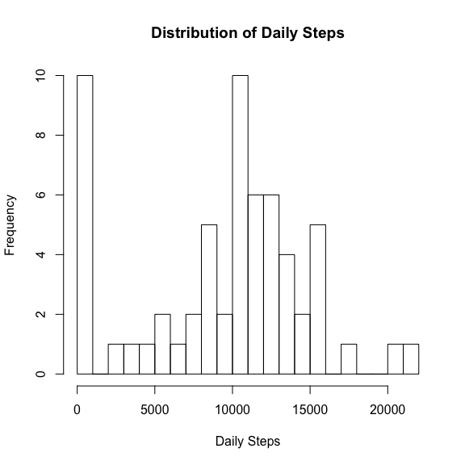
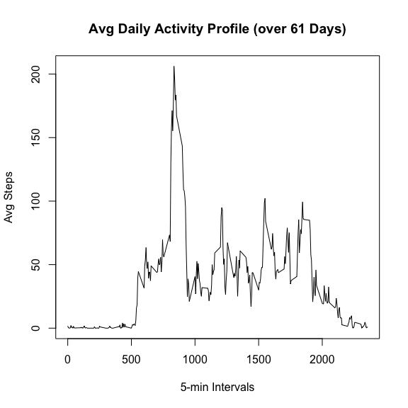
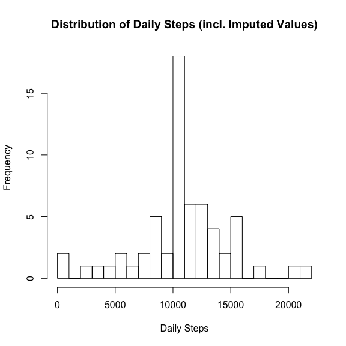
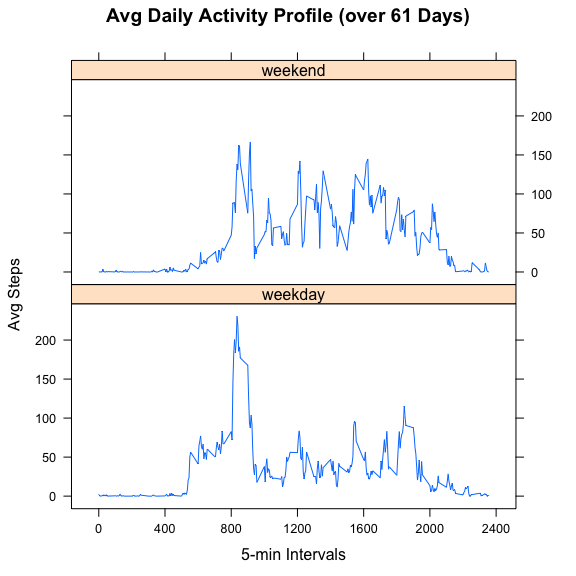

## Loading and preprocessing the data

We directly unzip-and-load into a data frame...

```r
activity <- read.csv(unz("activity.zip","activity.csv"))
```

We don't need to apply any further data pre-processing at this stage, i.e. we keep missing data points (steps = NA).


## What is mean total number of steps taken per day?

We sum up the number of steps for each day (a.k.a. each date), ignoring records where step value is missing...

```r
daily_steps <- tapply(activity$steps, activity$date, sum, na.rm = TRUE)
```

We draw an histogram of the daily steps to understand better their distribution...

```r
hist(
  daily_steps,
  breaks = 25,
  main = "Distribution of Daily Steps", 
  xlab = "Daily Steps",
  ylab = "Frequency"
)
```

<!-- -->

The histogram shows us what could be a relatively Gaussian distribution of the daily steps (centered around 11000 steps), BUT we can clearly see at least one peak (in the 1000-steps bin) that invalidates the Gaussian distribution pattern.

Now, let's remember that the activity recording is for a single individual here and over 2 months (61 days).  So we see that there is a non negligible number of days (10, a.k.a. ~16% of days) where the activity is clearly 'very low' (< 1000 steps)... OR it could be that most of the missing data are concentrated on those days (we will investigate that a bit later).

The mean daily steps:

```r
mean_daily_steps <- mean(daily_steps)
mean_daily_steps
```

```
## [1] 9354.23
```

The median daily steps:

```r
median_daily_steps <- median(daily_steps)
median_daily_steps
```

```
## [1] 10395
```

Note - As for the histogram, the fact that we ignored the missing data records here may distort the mean and median, making them lower than what they may be in reality (a.k.a. as per actual activity of the subject).


## What is the average daily activity pattern?

We calculate the average of steps for each 5-min interval accross the 61 days of records available, ignoring records where step value is missing (NA)...

```r
avg_daily_profile <- tapply(activity$steps, activity$interval, mean, na.rm = TRUE)
```

Let's visualize this...

```r
intervals <- unique(activity$interval)

plot(
  x = intervals,
  y = avg_daily_profile, 
  type = "l",
  main = "Avg Daily Activity Profile (over 61 Days)", 
  xlab = "5-min Intervals",
  ylab = "Avg Steps"
  )
```

<!-- -->

We see clear peak of activity (up to ~ 200 steps) around 8-9am, which could be due to commuting (but then we would probably expect a similar peak at evening time, which is not the case) or (more likely) that person likes to go to the gym in the morning.  Those are of course not the only possible reasons...  We are looking at averages over 61 days here (including work days, weekends or whatever else - e.g. vacations, sick days...) so we can't really conclude that this represents the "typical" daily activity of the subject.

The previous graph showed us that there was a clear, single, maximum number of steps (in average over 61 days) happening in one particular 5-min interval...  That interval is:

```r
intervals[which.max(avg_daily_profile)]
```

```
## [1] 835
```


## Imputing missing values

As mentioned earlier, there are a number of days/intervals where there are missing values (coded as NA).  The presence of missing days may introduce bias into some calculations or summaries of the data.

The total number of records showing NA (out of 17568 records in total) is:

```r
records_with_no_data <- sum(is.na(activity$steps))
records_with_no_data
```

```
## [1] 2304
```

The number of days where we have no data at all (out of 61 days in total) is:

```r
daily_steps_incl_no_data <- tapply(activity$steps, activity$date, sum, na.rm = FALSE)
days_with_no_data <- sum(is.na(daily_steps_incl_no_data))
days_with_no_data
```

```
## [1] 8
```

There are 288 5-min intervals within a day, which means our 8 days with no data at all represent the entirety of the 2304 missing data records...

So, since we are missing all data for those days, we will simply apply the avg daily profile (calculated in question 2) to them...

```r
activity_imputed <- activity
activity_imputed$steps <- replace(activity_imputed$steps, is.na(activity_imputed$steps), avg_daily_profile)
daily_steps_imputed <- tapply(activity_imputed$steps, activity_imputed$date, sum)
```

Note - another interesting takeaway (of missing data corresponding to full day of missing data) is that the daily activity profile calculated in question 2 was therefore based on 'fully-clean' days (a.k.a. we didn't miss ANY 5-min interval measurement for those days). In other words: the missing data didn't detoriate the data quality of the avg profile in terms of relative contribution of any specific 5-min interval... The only possible bias introduced was in terms of relative variance of activity between days (e.g. missing data all falling on weekend days). We may address that a bit more in question 4.

For now, let's redraw an histogram of the daily steps (similar to what we did for question 1) with the new data set that includes imputed values...

```r
hist(
  daily_steps_imputed,
  breaks = 25,
  main = "Distribution of Daily Steps (incl. Imputed Values)", 
  xlab = "Daily Steps",
  ylab = "Frequency"
)
```

<!-- -->

We now observe something that's closer to a Gaussian distribution, with a mean around 11000 steps and a fairly small variance.

Compared to the mean daily steps we had obtained when ignoring the missing data (9354.2295082), the mean now is:

```r
mean(daily_steps_imputed)
```

```
## [1] 10766.19
```

The mean is obviously higher than before, which is expected because we replaced days with no data before (a.k.a. an avg daily steps of zero for some days) with something now based on the avg daily profile (calculated previously on 'full-clean' days).

Compared to the median daily steps we had obtained when ignoring the missing data (10395), the median now is:

```r
median(daily_steps_imputed)
```

```
## [1] 10766.19
```

The median is now aligned with the mean, which confirm that we are much more on a Gaussian distribution profile than before.  The distribution is not skewed as it was before.  Of course, that doesn't mean that we cannot (or should not) see variation of the activity between days... That's something we will address in the next question.


## Are there differences in activity patterns between weekdays and weekends?

Let's consider our data set with imputed data (from previous question) and flag the days belonging to weekday and weekend respectively...

```r
activity_imputed$day_type <- as.factor(
    ifelse(weekdays(as.POSIXlt(activity_imputed$date)) %in% c("Saturday","Sunday"), "weekend", "weekday")
)
```

Now, let's recalculate some avg daily activity profile (across days) as in question 2, but doing that separately for weekday and weekend days...

```r
avg_daily_profiles <- tapply(activity_imputed$steps, list(activity_imputed$day_type, activity_imputed$interval), mean)
avg_daily_profiles <- as.data.frame(as.table(avg_daily_profiles))
names(avg_daily_profiles) <- c("day_type","interval","steps")
avg_daily_profiles$interval <- as.numeric(as.character(avg_daily_profiles$interval))
```


Finally we can draw the average daily activity profiles, both for weekend and weekday respectively:

```r
require(lattice)
```

```
## Loading required package: lattice
```

```r
xyplot(
    steps ~ interval | day_type, 
    data = avg_daily_profiles, 
    layout = c(1, 2), 
    type = "l", 
    main = "Avg Daily Activity Profile (over 61 Days)", 
    xlab = "5-min Intervals", 
    ylab = "Avg Steps",
    scales = list(x = list(at = c(0,400,800,1200,1600,2000,2400), labels = c(0,400,800,1200,1600,2000,2400)))
)
```

<!-- -->

We notice that the morning peak of activity we had noticed in question 2 is not occuring during weekends.  On the other hand, during weekends, there is slightly more activity from noon to early evening (a few peaks in the 100-150 steps area whereas we barely go above 100 steps within the same period for weekday activity).

That could correspond to a subject with relatively sedentary job (e.g. sitting in front of computer most of work day).  But we don't have enough information here, of course, to conclude that for sure (which is perhaps some good news regarding respect of privace for our subject :D).
